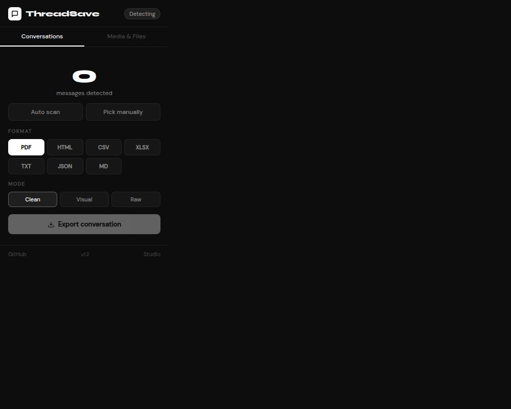

# Thread Saver Extension

The browser-extension implementation behind the Thread Saver idea.

It detects conversation blocks on a page, extracts the useful text, preserves speaker structure, and stores the result for later use.

## Shape of the extension

- Content detector for conversation blocks
- Background service worker
- Popup interface
- Media detection
- Storage manager
- Manifest-based browser packaging

## Stack

`JavaScript` `Chrome Extension APIs` `HTML` `CSS`

## Preview

*A captured view of the extension popup.*

## Run it locally

1. Open `chrome://extensions`.
2. Enable Developer mode.
3. Choose **Load unpacked**.
4. Select this repository.
5. Open a page containing a conversation and try the extension.

[Open the code](https://github.com/Samuelnganga7933/Thread-Saver)
## Preview

*Captured from the extension popup.*
